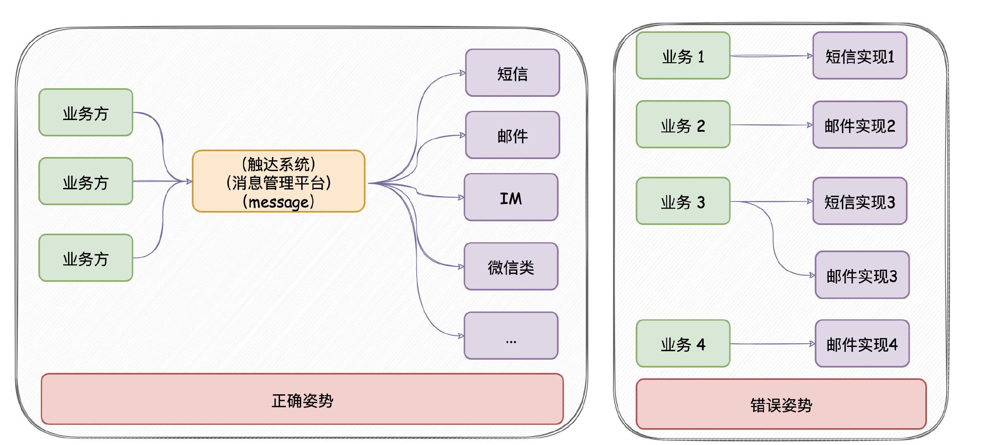

## 该项目学习博主Java3y的austin消息推送平台

学习其架构设计，自己重新写了一遍。

## 消息推送平台介绍

**核心功能**：统一的接口发送各种类型消息，对消息生命周期全链路追踪。

**意义**：只要公司内部有发送消息的需求，都应该要有类似dandelion的项目。消息推送平台对各类消息进行统一发送处理，这有利于对功能的收拢，以及提高业务需求开发的效率。

**架构图**：

**数据分析模块：**

在原项目基础上增加了对数据的简单分析，引入Echarts可视化

