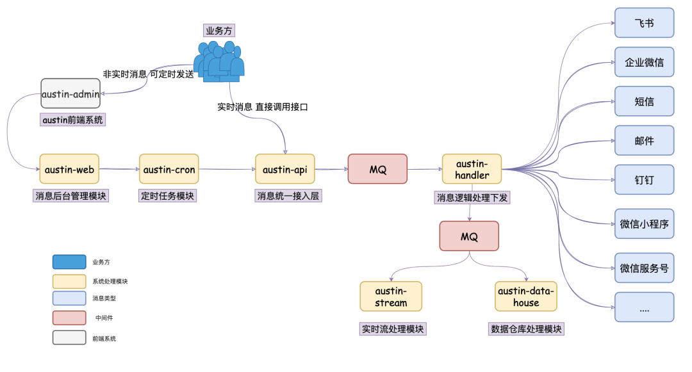
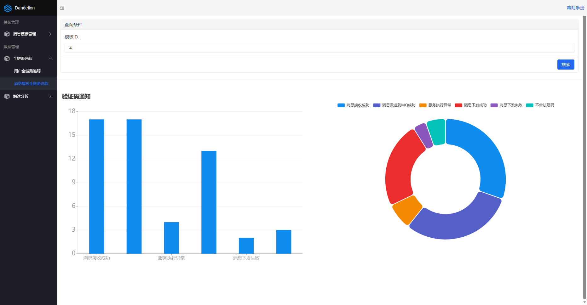
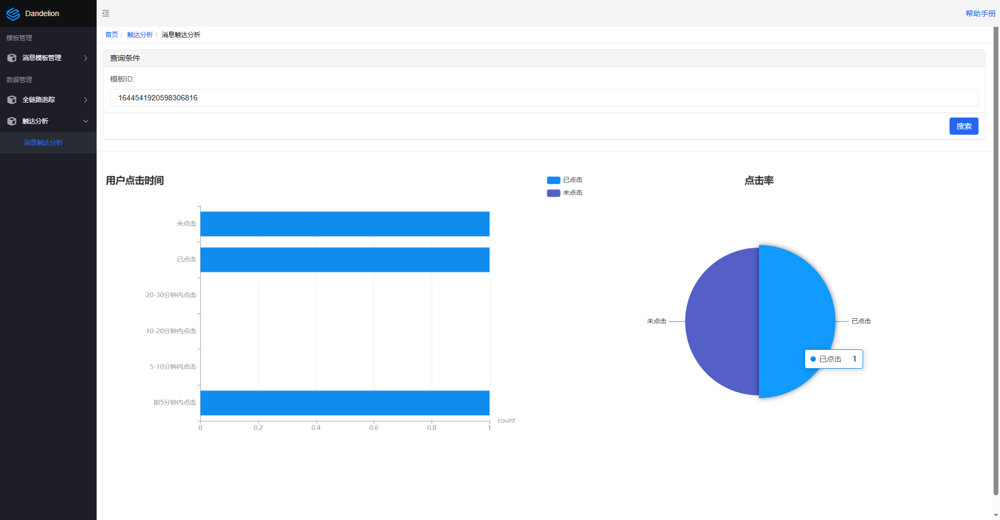

## 该项目学习博主Java3y的austin消息推送平台

学习其架构设计，自己重新写了一遍。

## 消息推送平台介绍

**核心功能**：统一的接口发送各种类型消息，对消息生命周期全链路追踪。

**意义**：只要公司内部有发送消息的需求，都应该要有类似dandelion的项目。消息推送平台对各类消息进行统一发送处理，这有利于对功能的收拢，以及提高业务需求开发的效率。

**实现：**

- 无痛拓展：项目使用了大量设计模式保证项目的高拓展性，如需要增加对飞书的支持，又或者是增加对夜间消息的过滤，不需要修改原有代码，仅需实现规定接口，增加配置，即可完成拓展。
- 生命周期链路追踪：每条消息下发前需要进行处理，如参数检验，去重，流量控制。Dandelion在每个关键处理的阶段上进行埋点，将点位收集到 RabbitMQ，再由 Flink 统一清洗处理，发挥流处理优势，最终将实时数据写入 Redis，用户可通过后台检查消息是否下发成功。
- 短链接追踪用户行为：收集营销信息链接的点击率，点击时间，并用 Echarts 制作图表展示。
- 高效处理大文件：在消息补发或定时消息这个场景下，需要读取待发送人文件，经测试在-Xmx100m 的参数下，也能快速处理一千万行数据，500m 大小的 csv 文件，不出现内存溢出。
- 消息资源调控和隔离：利用 Nacos 实现动态线程池，可配置化地对消费能力进行调控，不同的渠道不同的消息类型互不影响。

**架构图**：

**数据分析模块：**

在原项目基础上增加了对数据的简单分析，引入Echarts可视化

